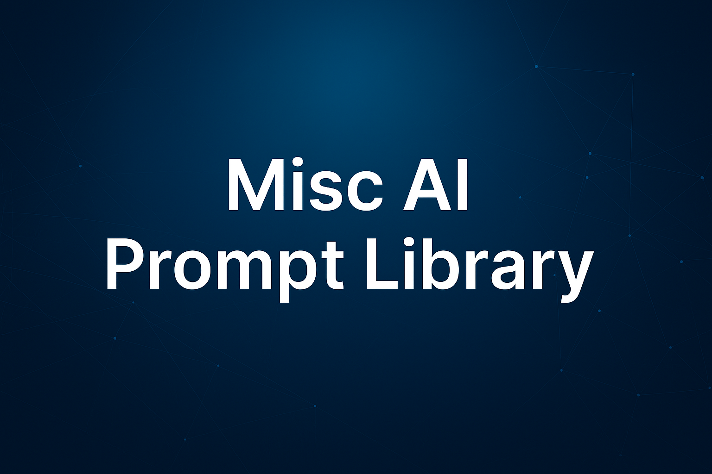

  

<h1 align="center">Misc AI Prompt Library</h1>
<h3 align="center">By Scott Malin — Cybersecurity & Automation Architect</h3>

Reusable AI prompt frameworks for productivity, communication, structured thinking, personal organization, and everyday problem‑solving.

  
  
  
  
  
  

---

# ⭐ Featured Prompt

### **Explain Like I'm Wrong – Reasoning Validator.md**  
**Goal:** Strengthen reasoning by having the AI intentionally misinterpret or challenge the user’s logic, forcing clarification, correction, and deeper understanding.

This prompt represents the repo’s core strength:  
**structured thinking, cognitive challenge, and clarity‑driven reasoning.**

---

# 📘 Overview

This repository contains **general‑purpose AI prompt frameworks** designed to improve:

- Productivity and task execution  
- Communication clarity  
- Reasoning and decision‑making  
- Personal organization  
- Creative exploration  
- Technical analysis  
- Facilitator‑led sessions  
- Everyday problem‑solving  

These prompts form a **Swiss‑army‑knife toolkit** for both personal and professional use.

---

# 📁 Repository Structure & Goals

Below is the categorized prompt catalog with **goal statements** for clarity and governance.

---

## 🧠 Reasoning, Analysis & Structured Thinking
- **Explain Like I'm Wrong – Reasoning Validator.md**  
  *Goal:* Challenge reasoning by forcing clarification and correction.  
- **Supercharged Fallacy Finder Prompt.md**  
  *Goal:* Identify logical fallacies and weak reasoning patterns.  
- **Documentation Gap & Clarity Analyzer.md**  
  *Goal:* Detect missing information, ambiguity, and unclear writing.  
- **Trend-researcher.md**  
  *Goal:* Analyze emerging trends across industries or topics.  
- **Useful Summary.md**  
  *Goal:* Produce structured, actionable summaries from any content.  

---

## 🧩 Cognitive Load & Human Factors Toolkit
- **Cognitive Load & Work Strain Mapping Interview.md**  
  *Goal:* Identify sources of overload and workflow friction.  
- **Cognitive Load – Facilitator Cheat Sheet.md**  
  *Goal:* Provide quick‑reference guidance for facilitators.  
- **Cognitive Load – Facilitator Pre‑Session Checklist.md**  
  *Goal:* Prepare facilitators for cognitive load workshops.  
- **Cognitive Load – Red Flags.md**  
  *Goal:* Highlight common indicators of cognitive strain.  
- **Facilitator‑Led Cognitive Load & Work Strain Mapping.md**  
  *Goal:* Run a guided, facilitator‑led cognitive load session.  

---

## 🛠️ Technical & Engineering Utilities
- **Code Recon.md**  
  *Goal:* Analyze unfamiliar codebases quickly and safely.  
- **Code Review Assistant.md**  
  *Goal:* Provide structured, high‑signal code review feedback.  
- **Network Engineer – Home Edition.md**  
  *Goal:* Diagnose and improve home network setups.  
- **Non‑Technical IT Help & Clarity Assistant.md**  
  *Goal:* Translate IT issues into plain language for non‑technical users.  
- **Plain‑Language Help Assistant for Non‑Technical Users.md**  
  *Goal:* Provide simple, accessible explanations for technical problems.  

---

## 🗣️ Communication, Writing & Creativity
- **Writer’s Block.md**  
  *Goal:* Break creative blocks with structured ideation.  
- **Analogy Generator.md**  
  *Goal:* Generate accurate analogies for complex concepts.  
- **The rest of the story.md**  
  *Goal:* Expand partial ideas into full narratives.  
- **PlainTalk Style Guide.md**  
  *Goal:* Enforce a clear, simple writing style.  
- **Interview‑style problem resolution prompt.md**  
  *Goal:* Walk users through structured problem‑solving conversations.  

---

## 🧭 Personal Productivity & Life Management
- **Lifehacks related to tasks.md**  
  *Goal:* Provide practical shortcuts for everyday tasks.  
- **Household Maintenance & Safety Assistant.md**  
  *Goal:* Help users maintain safe, efficient homes.  
- **I Think I Need a Lawyer.md**  
  *Goal:* Help users clarify legal concerns before seeking counsel.  
- **Project Skill & Resource Interviewer.md**  
  *Goal:* Identify skills, gaps, and resources needed for a project.  

---

## 🍽️ Food, Travel & Lifestyle
- **Constraint‑First Recipe Generator.md**  
  *Goal:* Create recipes based on constraints (diet, ingredients, tools).  
- **Ingredient‑Driven Creativity Generator.md**  
  *Goal:* Generate creative dishes from available ingredients.  
- **Food Scout.md**  
  *Goal:* Recommend meals based on constraints, preferences, and context.  
- **Ultimate Travel Planner AI Prompt.md**  
  *Goal:* Build complete, personalized travel itineraries.  
- **AI Travel Agent.md**  
  *Goal:* Provide structured travel planning assistance.  

---

## 📺 Media, Events & Listings
- **Olympic Games Events Weekly Listings Prompt.md**  
  *Goal:* Generate weekly Olympic event schedules.  
- **Sports Events Weekly Listings Prompt.md**  
  *Goal:* Produce weekly sports event summaries.  
- **TV Premiere Weekly Listing Prompt.md**  
  *Goal:* List upcoming TV premieres in a structured format.  

---

## 📰 Content Processing & Summarization
- **Content Processor.md**  
  *Goal:* Transform raw content into structured formats.  
- **Article Summarization & Comprehension Prompt.md**  
  *Goal:* Summarize articles and extract key insights.  

---

## 📄 Repo Files
- **LICENSE**  
- **README.md** (this file)

---

# 🕒 Version History / Changelog

### **v1.4 — February 2026**
- Added full categorized prompt catalog  
- Added new badges (Utility, Facilitator‑Ready)  
- Added a featured prompt that reflects the repo’s strengths  
- Updated structure and file list  
- Improved clarity and governance alignment  
- Updated last‑updated badge  

### **v1.3 — January 2026**
- Added Cyber Blue banner  
- Unified README structure  
- Added featured prompt section  
- Standardized cross‑repo navigation  

---

# 🔗 Cross‑Links

- 🛡️ Cybersecurity Prompts → https://github.com/scottmalin68-commits/Cybersecurity-Prompts  
- 🧰 PowerShell Toolkit → https://github.com/scottmalin68-commits/Powershell_Scripts  
- 🎮 Learning Games → https://github.com/scottmalin68-commits/Learning-Games-Prompts  
- 🧭 Profile → https://github.com/scottmalin68-commits  

---

# 📜 License  
MIT License — see `LICENSE` for details.
