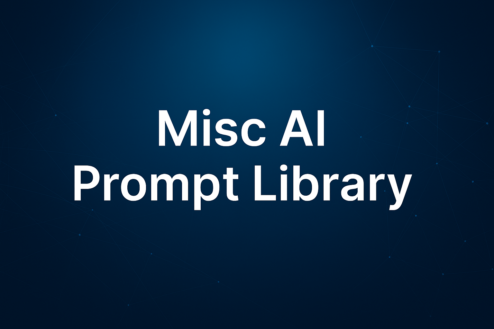

  

<h1 align="center">Misc AI Prompt Library</h1>
<h3 align="center">By Scott Malin — Cybersecurity & Automation Architect</h3>

Reusable AI prompt frameworks for productivity, communication, structured thinking, personal organization, and everyday problem‑solving.

  
  
  
  
  
  
  

---

# ⭐ Featured Prompts

### **Explain Like I'm Wrong – Reasoning Validator.md**
**Goal:** Strengthen reasoning by having the AI intentionally misinterpret or challenge the user’s logic, forcing clarification, correction, and deeper understanding.

### **MBTI Personality Interview.md** (v1.0.4)
**Goal:** Estimate personality preferences through an adaptive conversational interview with anti-bias controls, evidence weighting, contradiction handling, and a non-diagnostic final report. Added and hardened in September 2026.

This repo’s core strength: **structured thinking, cognitive challenge, and clarity‑driven reasoning.**

A fuller file index also lives in [prompts-index.md](prompts-index.md).

---

# 📘 Overview

This repository contains **general‑purpose AI prompt frameworks** designed to improve:

- Productivity and task execution  
- Communication clarity  
- Reasoning and decision‑making  
- Personal organization  
- Creative exploration  
- Technical analysis  
- Facilitator‑led sessions  
- Everyday problem‑solving  

These prompts form a **Swiss‑army‑knife toolkit** for both personal and professional use.

---

# 📁 Repository Structure & Goals

Below is the categorized prompt catalog with **goal statements** for clarity and governance.

---

## 🧠 Reasoning, Analysis & Structured Thinking
- **Explain Like I'm Wrong – Reasoning Validator.md** — Challenge reasoning by forcing clarification and correction.  
- **Supercharged Fallacy Finder Prompt.md** — Identify logical fallacies and weak reasoning patterns.  
- **Documentation Gap & Clarity Analyzer.md** — Detect missing information, ambiguity, and unclear writing.  
- **Trend-researcher.md** — Analyze emerging trends across industries or topics.  
- **Useful Summary.md** — Produce structured, actionable summaries from any content.  
- **Multi-Agent Fact-Checking System.md** — Evidence-grounded multi-agent fact check with JSON-only output.  
- **AI Hallucination & Reliability Analysis Engine.md** — Inspect model reliability and failure modes.  
- **Prompt Refinement Engine.md** — Tighten prompts against drift and instruction conflict.  

---

## 🧩 Cognitive Load & Human Factors Toolkit
- **Cognitive Load & Work Strain Mapping Interview.md** — Identify sources of overload and workflow friction.  
- **Cognitive Load – Facilitator Cheat Sheet.md** — Provide quick‑reference guidance for facilitators.  
- **Cognitive Load – Facilitator Pre‑Session Checklist.md** — Prepare facilitators for cognitive load workshops.  
- **Cognitive Load – Red Flags.md** — Highlight common indicators of cognitive strain.  
- **Facilitator‑Led Cognitive Load & Work Strain Mapping.md** — Run a guided, facilitator‑led cognitive load session.  

---

## 🧠 Interviews, Personality & Discovery
- **MBTI Personality Interview.md** — Adaptive preference interview with anti-bias and uncertainty handling (v1.0.4).  
- **Personality Interview Engine.md** — Broader personality-interview framework.  
- **Training architect interview engine.md** — Design training through a structured interview (v1.5.1).  
- **AI Process Feasibility Interview.md** — Test whether a process is a good AI candidate.  
- **Project Skill & Resource Interviewer.md** — Identify skills, gaps, and resources needed for a project.  
- **Car Buying Intake Interview.md** / **Gathering Planner Interview.md** — Domain intake interviews.  

---

## 📁 Meetings, Content & Continuity
- **Advanced Teams Meeting Analyst (Copilot Enhancement).md** — Evidence-based Teams transcript analysis (v1.8.0).  
- **Audio Meeting Analyst.md** — Meeting analysis from audio/transcript input.  
- **Content Processor.md** — Transform raw content into structured formats (v1.2.1).  
- **Context Spellcheck Engine.md** — Detection-only contextual misspellings; writer keeps judgment.  
- **Article Summarization & Comprehension Prompt.md** — Neutral, grounded article summaries.  
- **Session Continuity Engine.md** / **AI Conversation Export & Continuity Engine.md** — Carry work across sessions.  

---

## 🛠️ Technical & Engineering Utilities
- **Code Recon.md** — Analyze unfamiliar codebases quickly and safely.  
- **Code Review Assistant.md** — Provide structured, high‑signal code review feedback.  
- **Network Engineer – Home Edition.md** — Diagnose and improve home network setups.  
- **Non‑Technical IT Help & Clarity Assistant.md** — Translate IT issues into plain language.  
- **Plain‑Language Help Assistant for Non‑Technical Users.md** — Simple explanations for technical problems.  
- **System Rebuild Architect Engine.md** — Plan a system rebuild from constraints.  
- **AI Kickstart prompt.md** / **AI Tool Matchmaker.md** — Get started with AI tools without hype.  

---

## 🗣️ Communication, Writing & Creativity
- **Writer’s Block.md** — Break creative blocks with structured ideation.  
- **Writing Advisor Prompt.md** — Targeted writing feedback.  
- **Analogy Generator.md** — Generate accurate analogies for complex concepts.  
- **The rest of the story.md** — Expand partial ideas into full narratives.  
- **PlainTalk Style Guide.md** — Enforce a clear, simple writing style (v1.6.1).  
- **Interview‑style problem resolution prompt.md** — Walk users through structured problem‑solving conversations.  
- **Lazy AI Email Detector.md** — Flag generic AI-sounding email.  
- **Patient Subject Tutor.md** — Slow, confidence-tracked tutoring.  
- **Generic Whiteboard Infographic Style.md** — Structured infographic content framework.  

---

## 🧭 Personal Productivity & Life Management
- **Lifehacks related to tasks.md** — Practical shortcuts for everyday tasks.  
- **Household Maintenance & Safety Assistant.md** — Help users maintain safe, efficient homes.  
- **I Think I Need a Lawyer.md** — Clarify legal concerns before seeking counsel.  
- **Intent-Aware Shopping Advisor.md** / **Listing Intelligence Engine.md** — Buying and listing analysis.  
- **Vehicle Purchase Agreement Intelligence Engine.md** — Read vehicle paperwork for risk and terms.  
- **Generic Driveway Snow Clearing Advisor.md** — Seasonal household utility.  
- **Learning Resource Discovery Engine.md** — Find learning resources from a goal.  

---

## 🍳 Food, Travel & Lifestyle
- **Constraint‑First Recipe Generator.md** — Create recipes based on constraints.  
- **Ingredient‑Driven Creativity Generator.md** — Generate creative dishes from available ingredients.  
- **Food Scout.md** — Recommend meals based on constraints and context.  
- **Ultimate Travel Planner AI Prompt.md** — Build complete, personalized travel itineraries.  
- **AI Travel Agent.md** — Structured travel planning assistance.  
- **Celestial Vision - Zenith Precision.md** — Precision visual / observational framing.  

---

## 📺 Media, Events, Markets & Listings
- **Olympic Games Events Weekly Listings Prompt.md** — Generate weekly Olympic event schedules.  
- **Sports Events Weekly Listings Prompt.md** — Weekly sports event summaries (v2.0).  
- **TV Premiere Weekly Listing Prompt.md** — Upcoming TV premieres in a structured format.  
- **Internet Trend & Slang Intelligence Briefing.md** — Current slang/trend briefing with source discipline.  
- **Sector Growth Stock Analysis.md** — Public-data sector screen (v1.7.1).  
- **Long-Term Equity Investment Analysis Framework.md** — Long-horizon equity analysis structure.  
- **Signal & Shelf.md** — Signal-versus-inventory style listing helper.  

---

## 📄 Repo Files
- **LICENSE**  
- **README.md** (this file)  
- **prompts-index.md**  

---

# 🕒 Version History / Changelog

### **v1.6 — September 2026** (current)
- Added MBTI Personality Interview (through v1.0.4) with anti-bias and contradiction handling  
- Added Context Spellcheck Engine, hardened Content Processor, Teams Meeting Analyst v1.8.0, Training Architect v1.5.1, PlainTalk v1.6.1  
- Added / hardened Multi-Agent Fact-Checking, Sector Growth analysis, Sports/TV listing guards, Prompt Refinement Engine  
- Library-wide garbage-input, jailbreak, state-lock, and format-fallback pass  
- Last-updated badge: 2026-09-21  

### **v1.5 — February 2026**
- Added dynamic GitHub stars badge and Quick Start usage section  

### **v1.4 — February 2026**
- Added full categorized prompt catalog and featured reasoning prompt  

---

# 🔗 Cross‑Links

- 🛡️ Cybersecurity Prompts → https://github.com/scottmalin68-commits/Cybersecurity-Prompts  
- 💼 Job Search & Career Prompts → https://github.com/scottmalin68-commits/Job-Search-Career-Prompts  
- 🎮 Cybersecurity Learning Prompts → https://github.com/scottmalin68-commits/Cybersecurity-Learning-Prompts  
- 🧰 PowerShell Toolkit → https://github.com/scottmalin68-commits/Powershell_Scripts  
- 🎮 Learning Games → https://github.com/scottmalin68-commits/Learning-Games-Prompts  
- 🧭 Profile → https://github.com/scottmalin68-commits  

---

**Quick Start:** Copy any prompt .md → paste into Grok, Claude, ChatGPT, etc. → follow the instructions and respond iteratively. Most are self-contained and ready for personal or facilitator use.

# 📜 License  
MIT License — see `LICENSE` for details.
